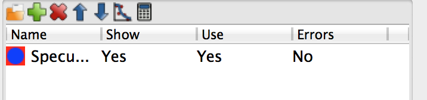

.. _tutorial-gui:

*******************************
Overview of the  user interface
*******************************

Note: This is under construction, no screen shots yet due to lack of a real computer...

Main window
===========
The main window in GenX is the main work area. It consists of three notebooks separated by resizeable
boundaries. The leftmost is the Data notebook. The upper right one is the Plot notebook and the lower right
is the Model/Fit notebook. The following sections will briefly go through the different notebooks to give a
quick tour of the program.

.. image:: _attachments/gui/main_gui.png

Data notebook
-------------
The Data notebook is for handling the data. It has two tabs:

Data
     Used to handle the data sets. Loading data reorder data sets, choosing which data sets to plot.
View
     A spreadsheet view of the data for looking at the number.
     The view is rather self explanatory at the top of the notebook is a choicebox where the data set one
     wants to view is chosen. The raw and transformed data is shown in the spreadsheet columns. Its best use is for
     looking at data that gives trouble.

The Data tab has more features. The list shows all created data sets the small toolbar at the
top gives shortcuts to the most used functions. From the left this is

* Loading data.
* Insert new data set.
* Remove marked data set(s).
* Move current data set(s) up.
* Move current data set(s) down.
* Change the plotting preferences of the marked data set(s). Brings up a dialog box. Not unique parameters will
  be displayed as blank (white for colors) and if not set in the dialog will remain unchanged and unique for multiple
  data sets if not changed.
* Do calculations/transformation of the marked data set(s). Same as for plotting.
  If one calculation/transformation is not the same for all marked data sets the calculation box will be
  empty and any expression will not be applied to the data sets if not explicitly typed.

For more information about how to handle the loading and transformation of data see :ref:`tutorial-data-handling`

Plot notebook
-------------
The plot notebook has four tabs.

Data
     Shows the data and simulated values.
FOM
     Shows the figure of merit (FOM) as a function of the generations when fitting.

     .. image:: _attachments/gui/fom.png

Pars
     Shows the population spread(blue bars) and the current best value (red dots) of the current
     generation when fitting. The horizontal axis is the parameter number in the grid and the vertical axis
     represent the normalized parameter value. Normalization is done according to the following formula
     :math:`p_{i,norm} = (p_i - p_{i,min})/(p_{i,max} - p_{i,min})` where :math:`p_i` is parameter number :math:`i`
     and :math:`min`, :math:`max`
     is the minimum and maximum allowed value for that parameter. This can be use to monitor the evolution of the
     fitting algorithm and make a decision when to stop it. (When you cant see the blue bars there will be also very
     little change in the parameter values)

     .. image:: _attachments/gui/pars.png

FOM scans
     This is used to plot scans of the FOM vs. one parameter, see below.

     .. image:: _attachments/gui/fom_scan.png

     Or using the population log to do projections onto one parameter axis, see image below.

     .. image:: _attachments/gui/fom_projection.png

     Both of these plots can be used to estimate error bars on the fitted parameters. The plots are made by right
     clicking on the row number in the grid and choose either :menuselection:`Scan FOM` or :menuselection:`Project FOM`.

Model/Fit notebook
------------------
The Model/Fit notebook has two tabs.

Grid
     Used to define which parameters of the model to fit. The Grid is a spreadsheet containing 6 columns.
     They are named Parameter, Value, Fit, Min, Max, Error. Parameter is the name of the parameter. For most
     models one can choose the parameter by right clicking on a marked cell that is not in edit mode (no cursor
     should be blinking in the cell) a pop-up menu will appear with a hierarchy of choices. Value is the Value of
     the parameter - this represents both the start guess and the result, during fitting it is used to show the current
     best value. Min and Max is the boundaries within which the parameter has to stay during fitting and initialization.
     The Error column is used to output calculated error bars.
     .. image:: _attachments/gui/grid.png
Model
     A script editor to edit the python script that defines the model. See for example the tutorial about writing
     your own model :ref:`tutorial-writing-model` or just go ahead to the tutorials for your specific
     problem :ref:`tutorial-xrr-fitting`, :ref:`tutorial-neutron-sim` or :ref:`tutorial-sxrd`.
