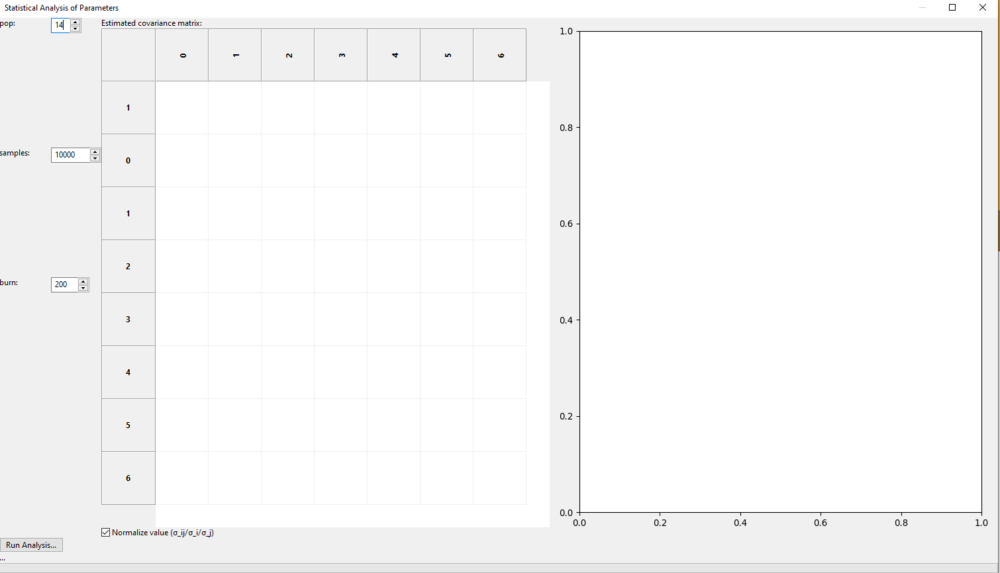

.. _tutorial-error-statistics:

***********************************
Error Statistics from bumps library
***********************************

Performing Statistical Uncertainty Calculation
==============================================
GenX includes an interface to the `bumps <https://bumps.readthedocs.io/en/latest/>`_ library
for data fitting and uncertainty estimation. The library can be used as optimizer alternative
to the Differential Evolution but also to analyze the parameter statistics after a successful fit
with the standard DE method.

While a description of how the library works is out of the scope of this documentation (see link above),
this page will describe the basic usage of the parameter uncertainty estimation procedure and its parameters.

After finishing the refinement of you model to a valid chi2bars FOM, click the *Error Statistics* button:

.. image:: _attachments/bumps/par_proj.png

This will open the *Statistical Analysis of Parameters* dialog that will initially be empty:

There are there parameters that need to be set before running the analysis:

* :pop:
    The relative size of a *population* used for the Marcov-Chain Monte-Carlo method. This is multiplied with the
    number of free parameters in the fit to set the number of parameter sets calculated for each iteration of
    the algorithm. Good values are between 8 and 20.
* :samples:
    The number of parameter samples to be drawn randomly to buildub the parameter statistics. The initial value
    of 10000 is a low value good enough to get a rough estimation of uncertainties and an idea about the
    cross-correlations, in general. For publication quality results this needs to likely be increased.
* :burn:
    The number of iterations to run the algorithm before collecting the *samples* statistics. For a pre-fitted
    model 200 seems a good value. If you see artifacts in the plot like far outliers that seem strange, try
    to run again with a higher burn value.

After choosing these parameters, press the *Run Analysis* button to perform the calculations. For complex models
with good statistics this can take several minutes.

After the run has finished the left side of the dialog will be populated with a normalized covariance matrix
as well as the fitted parameter values and uncertainties on the left. Colors indicate the amound of
cross-correlation between two parameters.
For well behaved models the diagonal elements of the normalized matrix should approach 1 for good statistics,
indicating that the covariance indices correspond to the estimated parameter uncertainty.
In some cases, like roughness parameters that tend to zero, this rule of thumb can be violated as in the
case of the Sub.Sigma parameter in the example below.

.. image:: _attachments/bumps/covariance_matrix.png
    :width: 60%

The right side panel will show a graph of the parameter distribution for two parameters with a color
indicating parameter probability, which is the basis for the covariance matrix estimation, in logarithmic scale.
Initially the parameter pair with the largest absolute cross-correlation is shown, but the
graph can be changed to any pair of different parameters by double clicking on the matrix entry.

.. image:: _attachments/bumps/parameter_correlation.png
    :width: 60%

After the evaluation you can copy-paste the table into e.g. Excel and the error values are stored
in the GenX paramter table for export. If you export to the new ORSO *.ort* format the full
error estimation, including covariance matrix, will be written to the file header information.

Including Systematic Errors in XRR/NR Modls
===========================================
Will be discussed in new GenX publication and added here once I find the time do write it. A common
feature of such treatment is the advantage of making Chi² a valid FOM again and allowing statistically
correct treatment of parameter uncertainties.

XRR
^^^

Monochromatic NR
^^^^^^^^^^^^^^^^

Time-of-Flight NR
^^^^^^^^^^^^^^^^^

