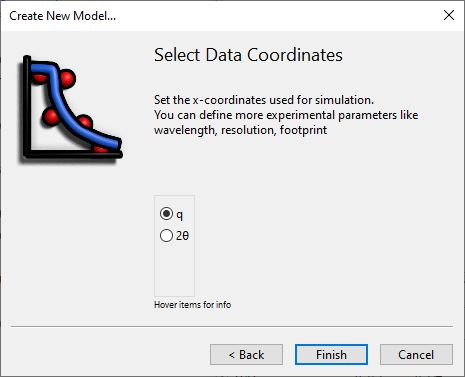
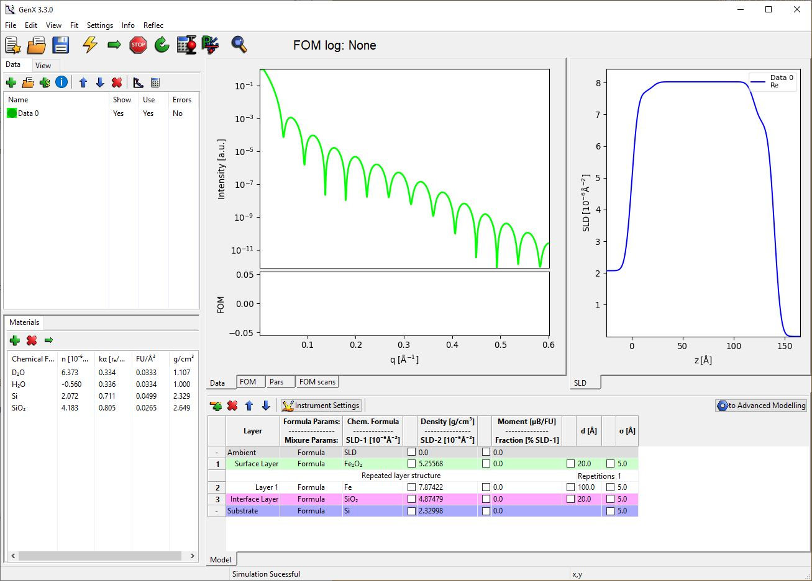
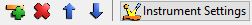

.. _tutorial-simple-reflectivity:

**********************************
Simple Reflectivity Model (XRR/NR)
**********************************
This tutorial will show you the general use of the SimpleReflectivity plugin (see :ref:`tutorial-plugin`) to
build a neutron or x-ray reflectivity model and fit it to your data.

Getting started
===============
Start by opening GenX and selecting the SimpleProfile. (Or load the simple reflectivity
plugin by going to the menu :menuselection:`Settings-->Plugins-->Load-->SimpleReflectivity`.)

When creating a new model the GUI will show a wizard to guide you through the initial model setup:

.. image:: _attachments/simple_reflectivity/wizard1.JPG
    :width: 32 %
.. image:: _attachments/simple_reflectivity/wizard2.JPG
    :width: 32 %

Afterwards the GUI will show the initial interface with a preset model of a 3-Layer system with air above
and silicon as a substrate:

The Model Table
===============
At the bottom is a table with the sample structure. Each model has one Ambient layer
(media the neutron propagates through before reflection), a set of top layers (green) that are not repeated,
a set of central layers (white) that can be repeated if Repetition is >1, a set of bottom layers (purple) that
are not repeated and finally a substrate at the bottom.
Each of the layers have the same set of parameters (besides thickness that is missing for Ambient and Substrate)
whose meaning depends on the selection in the Second column (Formula/Mixure).

.. image:: _attachments/simple_reflectivity/InitialTable.JPG

These parameters are:

* Formula

    * :Layer:
        User defined name for each layer, has to be unique
    * :Chem. Formula:
        Define the elemental composition for the layer as sum formula (e.g. Fe2O3).
        In case that you would prefer to enter the scattering length density directly set this to *SLD*
    * :Density [g/cm³]:
        Material mass density for the layer. If *Chem. Formula* is *SLD* this is the
        scattering length density in units of 10⁻⁶ Ų.
    * :Moment [µB/FU]:
        Magnetic moment, if any, within the layer in units of 1 Bohr-Magneton per given Chemical
        formula unit (FU). This value has no obvious meaning for *Chem. Formula* set to *SLD*.
    * :d [Å]:
        Thickness of this layer.
    * :σ [Å]:
        Roughness of this layer.

* Mixure (of two materials)

    * :Layer:
        User defined name for each layer, has to be unique
    * :SLD-1 [10⁻⁶ Ų]:
        Scattering length density (SLD) for the first material
    * :SLD-2 [10⁻⁶ Ų]:
        SLD for the second material
    * :Fraction [% SLD-1]:
        Amount of first material in the mixture (e.g. H2O vs. D2O)
    * :d [Å]:
        Thickness of this layer.
    * :σ [Å]:
        Roughness of this layer.

Layers can be added, deleted and moved within their *block* with the
toolbar buttons above after selecting a layer in the grid:

If all layers of a top or bottom *block* have been removed, they can be added by selecting
the *Ambient* or *Substrate* lines.
The *to Advanced Model* button on the right of the toolbar allows to quickly convert the
model to the *Reflectivity* plugin for more advanced modeling options.
(see :ref:`tutorial-xrr-fitting` and :ref:`tutorial-neutron-sim`.)

Instrument Parameters
=====================
For parameters that concern the experiment itself a dialog can be opened with the **Instrument Settings** button
in the toolbar. The dialog allows to choose:

* :probe:
    The radiation type used
* :wavelength:
    The wavelength used, if not measureing time of flight neutrons
* :I0:
    Initial intensity, for nomalized data this should be 1.0
* :coords:
    Coordinats of the x-axes, angle 2-Theta or wavevector transfer q
* :Ibkg:
    Constant experimental background (value at high q)
* :res:
    Instrumental resolution in the same coordinates as x
* :footype:
    Function used for footprint correction. *no corr* for no correction, *square-* or *gaussian beam* profile
* :samplelen:
    Length of the sample along the beam, ignored if *no corr* was selected
* :beamw:
    Width of the beam in scattering direction, for *gaussian* beam this is the sigma value

.. image:: _attachments/simple_reflectivity/InstrumentEditor.JPG

.. note::
    If a data loader was selected that supports a resolution column (*orso*, *resolution*, *d17_cosmos*, *sns_mr* etc.)
    the SimpleReflectivity plugin automatically uses this column for the resolution if the *res* parameter is
    not zero. If there are issues with the resolution column the *Calculation on selected dataset(s)* dialog
    has to be used to modify the *res* column.

Reading the data
================
To load the data select the dataset in the list on the right and click the small *Open* icon above it to import
a dataset. For multiple datasets you can add more entries by pushing the *plus* button in the same toolbar.

If you are using the generic *auto*, *default* or *resolution* data loader you may have to first select the data file
columns that correspond to x, y, dy (and maybe resolution). This can be done with the
:menuselection:`Settings-->Import` menu option.

For an example dataset you can create a new model and choose *neutron*, *d17_legacy* and *q* from the wizard. Then
select the dataset and open D17_SiO.out from the GenX examples folder
(found also on `github <https://github.com/aglavic/genx/tree/master/genx/genx/examples>`_).
Remove green and purple layers from top and
bottom and choose "Si" with density 2.32998 for the substrate and "SiO" with density 2.5 and thickness around
1200 Å for the layer. The Interface should now look like this:

.. image:: _attachments/simple_reflectivity/ModelBuild.JPG

You can zoom in to better see the oszillations using the magnifying glass button:

.. image:: _attachments/simple_reflectivity/ModelZoom.JPG

Fitting the model
=================
You can choose which parameters to fit by checking the box left of it. Selecting the layer density, thickness
as well as layer and substrate roughnesses should be sufficient to properly fit this dataset. When you are ready,
press the green right arrow in the window toolbar or press *ctrl+F*. You should see a live update of the model
as well as a status message at the bottom reporting the current figure of merit *FOM*, *Generation* and simulation *Speed*.
If the FOM value does not change over 30-50 generations you can stop the fit manually or wait for the maximum
number of generations to be computed. At the end your result should look like this:

.. image:: _attachments/simple_reflectivity/ModelFitted.JPG

Thei FOM for refinement can be chosen from the dialog accessed through :menuselection:`Settings-->Optimizer`.
Most of the settings in this dialog are for advanced users to optimize the fitting performance and can be ignored.

.. image:: _attachments/simple_reflectivity/OptimizerSettings.JPG

Parameter uncertainties
=======================
After a fit is finished it is possible to get an estimation on parameter uncertainties by clicking on the *calculate
errorbars* button. This will open a dialog with a table showing the fitted parameters, their result value and
an estimate on errors in negative and positive direction.

.. image:: _attachments/simple_reflectivity/ParameterErrors.JPG

.. note::
    These values are only a generic estimat about more or less certain parameters
    and not quantitative values that are statistically rigourusly treated.
    For statistically accurate errors you need to use the chi³ FOM and the *Error Statistics* calculation
    based on the *bumps* library. (Button **P** next to the one described above, see :ref:`tutorial-error-statistics`.)
